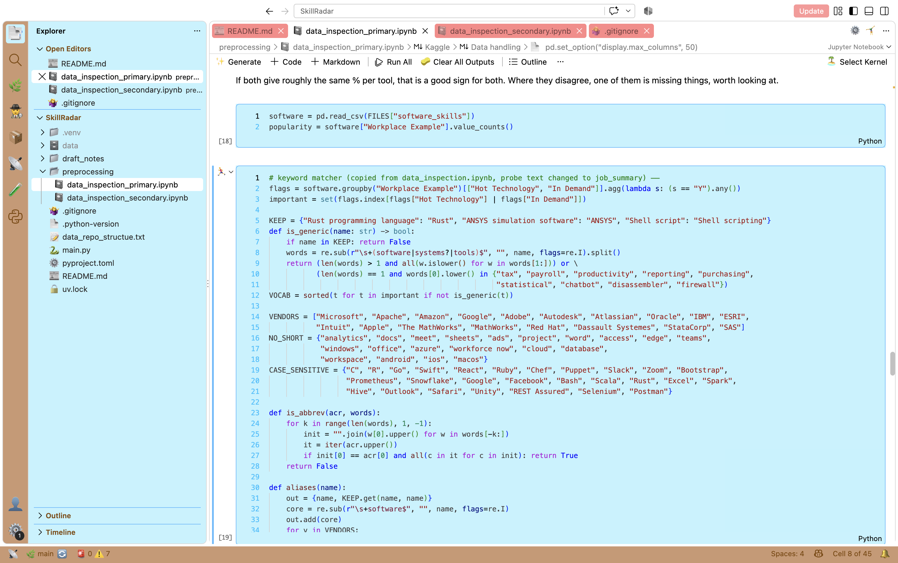

<!-- # Cute theme inspired by Cinnamoroll from Sanrio!

This is a theme for VsCode with colors that resemble Cinnamoroll from the Sanrio universe.

⠀⠀⠀⠀⠀⠀⠀⠀⠀⠀⠀⠀⠀⠀⠀⢀⣀⣤⡤⠤⠤⠤⣤⣄⣀⠀⠀⠀⠀⠀⠀⠀⠀⠀⠀⠀⠀⠀⠀⠀⠀⠀⠀⠀⠀⠀⠀
⠀⠀⠀⠀⠀⠀⠀⠀⠀⠀⠀⠀⢀⡤⠞⠋⠁⠀⠀⠀⠀⠀⠀⠀⠉⠛⢦⣤⠶⠦⣤⡀⠀⠀⠀⠀⠀⠀⠀⠀⠀⠀⠀⠀⠀⠀⠀
⠀⠀⠀⠀⠀⠀⠀⢀⣴⠞⢋⡽⠋⠀⠀⠀⠀⠀⠀⠀⠀⠀⠀⠀⠀⠀⠀⠈⠃⠀⠀⠙⢶⣄⠀⠀⠀⠀⠀⠀⠀⠀⠀⠀⠀⠀⠀
⠀⠀⠀⠀⠀⠀⣰⠟⠁⠀⠘⠀⠀⠀⠀⠀⠀⠀⠀⠀⠀⠀⠀⠀⠀⠀⠀⠀⠀⢰⡀⠀⠀⠉⠓⠦⣤⣤⣤⣤⣤⣤⣄⣀⠀⠀⠀
⠀⠀⠀⠀⣠⠞⠁⠀⠀⠀⠀⠀⠀⠀⠀⠀⠀⠀⠀⠀⠀⠀⠀⠀⠀⣴⣷⡄⠀⠀⢻⡄⠀⠀⠀⠀⠀⠀⠀⠀⠀⠀⠀⠈⠻⣆⠀
⠀⠀⣠⠞⠁⠀⠀⣀⣠⣏⡀⠀⢠⣶⣄⠀⠀⠀⠀⠀⠀⠀⠀⠀⠀⠹⠿⡃⠀⠀⠀⣧⠀⠀⠀⠀⠀⠀⠀⠀⠀⠀⠀⠀⠀⠸⡆
⢀⡞⠁⠀⣠⠶⠛⠉⠉⠉⠙⢦⡸⣿⡿⠀⠀⠀⡄⢀⣀⣀⡶⠀⠀⠀⢀⡄⣀⠀⣢⠟⢦⣀⠀⠀⠀⠀⠀⠀⠀⠀⠀⠀⠀⣸⠃
⡞⠀⠀⠸⠁⠀⠀⠀⠀⠀⠀⠀⢳⢀⣠⠀⠀⠀⠉⠉⠀⠀⣀⠀⠀⠀⢀⣠⡴⠞⠁⠀⠀⠈⠓⠦⣄⣀⠀⠀⠀⠀⣀⣤⠞⠁⠀
⣧⠀⠀⠀⠀⠀⠀⠀⠀⠀⠀⠀⣼⠀⠁⠀⢀⣀⣀⡴⠋⢻⡉⠙⠾⡟⢿⣅⠀⠀⠀⠀⠀⠀⠀⠀⠀⠉⠉⠙⠛⠉⠉⠀⠀⠀⠀
⠘⣦⡀⠀⠀⠀⠀⠀⠀⣀⣤⠞⢉⣹⣯⣍⣿⠉⠟⠀⠀⣸⠳⣄⡀⠀⠀⠙⢧⡀⠀⠀⠀⠀⠀⠀⠀⠀⠀⠀⠀⠀⠀⠀⠀⠀⠀
⠀⠈⠙⠒⠒⠒⠒⠚⠋⠁⠀⡴⠋⢀⡀⢠⡇⠀⠀⠀⠀⠃⠀⠀⠀⠀⠀⢀⡾⠋⢻⡄⠀⠀⠀⠀⠀⠀⠀⠀⠀⠀⠀⠀⠀⠀⠀
⠀⠀⠀⠀⠀⠀⠀⠀⠀⠀⢸⡇⠀⢸⡀⠸⡇⠀⠀⠀⠀⠀⠀⠀⠀⠀⠀⢀⠀⠀⢠⡇⠀⠀⠀⠀⠀⠀⠀⠀⠀⠀⠀⠀⠀⠀⠀
⠀⠀⠀⠀⠀⠀⠀⠀⠀⠀⠘⣇⠀⠀⠉⠋⠻⣄⠀⠀⠀⠀⠀⣀⣠⣴⠞⠋⠳⠶⠞⠀⠀⠀⠀⠀⠀⠀⠀⠀⠀⠀⠀⠀⠀⠀⠀
⠀⠀⠀⠀⠀⠀⠀⠀⠀⠀⠀⠈⠳⠦⢤⠤⠶⠋⠙⠳⣆⣀⣈⡿⠁⠀⠀⠀⠀⠀⠀⠀⠀⠀⠀⠀⠀⠀⠀⠀⠀⠀⠀⠀⠀⠀⠀
⠀⠀⠀⠀⠀⠀⠀⠀⠀⠀⠀⠀⠀⠀⠀⠀⠀⠀⠀⠀⠀⠉⠉⠀⠀⠀⠀⠀⠀⠀⠀⠀⠀⠀⠀⠀⠀⠀⠀⠀⠀⠀⠀⠀⠀⠀⠀
⠀⠀⠀⠀⠀⠀⠀⠀⠀⠀

# HOW TO DOWNLOAD?

This is not an officially uploaded theme on VsCode, however, you can still make it work locally. I am currently using this theme as well (and might never change it).

First off, you have to clone this repository:

```bash
git clone https://github.com/Lucialululu/cinnamonroll-cute
```

Then you have to locate a folder named `.vscode`.

### For macos users:

This folder is often hidden on macbook, so by clicking `cmd + shift + .` at once, you can reveal it, it usually is located at `/Users/name/.vscode`. Once inside the `.vscode` folder, go to `extensions` and put this repository in that folder, so the directory will be `.vscode/extensions/`.

After this, you should be able to locate this theme in your VsCode extensions tab!

### For windows users:

Steps are the same, with locating the `.vscode` folder first, then put this repo folder into extensions.

___

If you really like this theme, you can donate me on MobilePay :).

**Enjoy!**
 -->

<p align="center">
  
</p>

<h1 align="center">☁️ Cinnamoroll Cute Theme ☁️</h1>

<p align="center">
  A soft, fluffy light theme for VS Code inspired by Cinnamoroll from Sanrio 🩵🤍🩷
</p>

---

## ✨ Features

- 🩵 Sky-blue sidebar and cozy cinnamon-brown activity bar
- 🩷 Pink inactive tabs so you always know which file you're on
- 🤍 Clean white editor that's easy on the eyes
- 📓 Jupyter notebook colors that match the rest of the theme

## 📸 Preview

<!-- Add a screenshot: images/preview.png -->


## 💾 Installation

This theme isn't on the VS Code Marketplace yet, but it's easy to install by hand.

**1. Clone the repo into your VS Code extensions folder**

| OS | Extensions folder |
|---|---|
| 🍎 macOS / 🐧 Linux | `~/.vscode/extensions` |
| 🪟 Windows | `%USERPROFILE%\.vscode\extensions` |

```bash
cd ~/.vscode/extensions
git clone https://github.com/Lucialululu/cinnamonroll-cute
```

> 💡 On macOS, `.vscode` is a hidden folder. In Finder, press `Cmd + Shift + .` to show hidden files.

**2. Restart VS Code**

**3. Pick the theme**

Open the Command Palette (`Cmd/Ctrl + Shift + P`), run **Preferences: Color Theme**, and choose **Cinnamoroll Sanrio**.

## 🩷 Support

I use this theme every day (and might never change it!). If you like it too, you can support me on MobilePay :)

<p align="center"><b>Enjoy! ☁️</b></p>